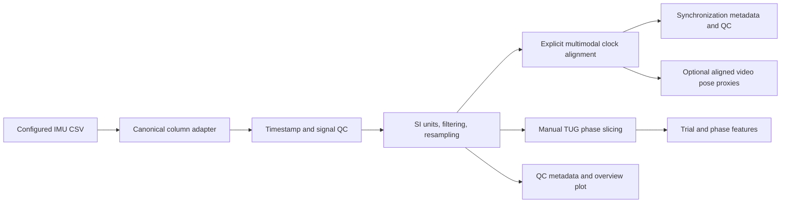

# Multimodal TUG-DT Analysis Pipeline

A reproducible research pipeline for organizing, validating, synchronizing, and analyzing
multimodal data collected during single-task and dual-task Timed Up and Go (TUG) assessments.
The data contract covers IMU/Xsens-derived motion, video, audio, footswitch signals, manual
phase annotations, and clinical or demographic metadata.

> Status: Milestones 1–7 are implemented. The repository provides the project and manifest
> contracts, privacy-safe synthetic data, configurable IMU CSV adapters, signal quality control,
> filtering, resampling, manual TUG phase segmentation, interpretable IMU features, plots, and
> explicit manual-offset synchronization with auditable metadata. Audio energy VAD, footswitch
> event analysis, video inspection, optional two-dimensional pose proxies, feature-level fusion,
> participant-grouped baseline models, aggregate reporting, and the executed demonstration
> notebook are research tools rather than clinical claims.

## Why this project exists

Human-movement studies often collect files with different clocks, sampling rates, naming
conventions, and missing modalities. Analysis can become difficult to reproduce before any
model is trained. This project starts with an explicit data contract: each trial has stable
identifiers, declared paths, configurable conditions, and validation that fails clearly when
the contract is broken.

The long-term research goal is to support clinically interpretable investigation of
cognitive-motor interference. This software is a research tool. It does not diagnose disease
and currently makes no clinical claims.

## Supported through Milestone 7

- YAML configuration with paths resolved from an explicit project root
- CSV participant/trial manifest with optional missing modalities
- Validation of schema, identifiers, conditions, duplicate trials, and referenced files
- Deterministic 20-second synthetic IMU, audio, footswitch, annotation, and clinical fixtures
- Installable `tugdt` command-line interface
- Structured validation reports and visible warnings for missing optional modalities
- Wide- and long-format IMU CSV adapters with configurable canonical column mapping
- Timestamp, sampling interval, duplicate, missing-value, and amplitude quality checks
- SI unit conversion, optional constant-gravity removal, low-pass filtering, resampling, and
  quaternion normalization
- Externally annotated TUG phase validation and half-open interval slicing
- Trial-level and phase-level step, acceleration, jerk, and turning features
- Per-trial QC JSON, project-level QC CSV, processed IMU CSV, and annotated overview plots
- `preprocess`, `extract-features`, and current-stage `run-all` commands
- IMU-reference clock alignment with explicit positive, zero, or negative offsets
- Native and reference timeline extents, uncertainty, operator, notes, overlap, and duration QC
- Synchronized footswitch CSV, validated reference-clock segments, per-trial synchronization
  metadata, project QC table, and timeline coverage plots
- WAV duration metadata and optional `ffprobe` support for other audio/video containers
- A strict error when an available target modality lacks an offset declaration
- WAV and optional FFmpeg audio decoding, mono normalization, resampling, clipping QC, and
  fixed-frame energy VAD
- Speech duration/ratio, internal pause, and explicitly configured first-response latency
  features at trial and TUG-phase levels
- Footswitch thresholding, short-run debounce, left/right contact and toe-off events, stance,
  swing, step-time, and stance-asymmetry features
- One-to-one IMU/footswitch event matching with precision, recall, F1, and timing error
- Blank transcript-dependent response count, correctness, and accuracy fields when no labels exist
- MP4, MOV, and AVI metadata inspection with duration, frame rate, frame count, dimensions, and codec
- Optional MediaPipe Tasks pose extraction with an explicit local model path and configurable frame step
- Long-form normalized landmarks with per-landmark visibility and presence confidence
- Trial- and phase-level pose detection, trunk lean, pelvis trajectory, ankle-separation, and
  lower-limb symmetry proxy features
- Metadata-only video processing when pose estimation is disabled
- Trial-level outer fusion that preserves missing modalities and adds explicit availability flags
- Machine-readable feature inventory with modality, dtype, observed, and missing counts
- Configurable single-modality and multimodal feature-set comparisons
- All-sample and complete-modality cohort evaluations
- Fold-local median imputation and scaling inside scikit-learn Pipelines
- Participant-grouped regression with linear, ridge, and random-forest baselines
- Participant-stratified grouped binary classification with logistic and random-forest baselines
- Fold metrics, summary comparisons, out-of-fold predictions, skipped evaluations, and a split
  audit proving zero participant overlap
- Deterministic aggregate Markdown reporting without participant IDs, raw paths, or individual
  feature values
- An executed synthetic-workflow notebook with modality, QC, and interpretation checks
- A public synthetic report example, reproducibility checklist, and end-to-end architecture diagram
- Citation metadata and continuous integration across supported Python versions
- Automated unit and integration tests

Video remains intentionally absent from the committed synthetic demo. That absence exercises
missing-modality behavior without creating a fake clinical video or normalizing the public release
of identifiable recordings. The video interface and feature mathematics are covered by generated
software fixtures in the test suite.

## Installation

Python 3.11 or newer is required.

```bash
python -m venv .venv
source .venv/bin/activate
python -m pip install -e '.[dev]'
```

For runtime-only installation, use `python -m pip install -e .`.

Video metadata requires `ffprobe` from FFmpeg. Optional pose extraction additionally requires:

```bash
python -m pip install -e '.[video]'
```

A compatible MediaPipe Pose Landmarker `.task` model must be downloaded separately and referenced
in configuration; the repository does not silently download or redistribute model assets.

## Quick start

Generate the public demonstration data:

```bash
tugdt generate-synthetic --output data/synthetic
```

Validate it using the example project configuration:

```bash
tugdt validate-manifest --config configs/example.yaml
```

Run the implemented pipeline:

```bash
tugdt run-all --config configs/example.yaml
```

The same stages can be run separately:

```bash
tugdt preprocess --config configs/example.yaml
tugdt synchronize --config configs/example.yaml
tugdt process-audio --config configs/example.yaml
tugdt process-footswitch --config configs/example.yaml
tugdt process-video --config configs/example.yaml
tugdt extract-features --config configs/example.yaml
tugdt fuse-features --config configs/example.yaml
tugdt run-baselines --config configs/example.yaml
tugdt generate-report --config configs/example.yaml
```

The committed demonstration contains one synthetic participant, so `modeling.enabled` is false in
`configs/example.yaml`. This prevents invalid cross-validation during `run-all`. Explicit baseline
evaluation requires a study with at least two independent participant groups, and binary
classification requires at least two participant groups containing each class.

Generated private/derived outputs are ignored by Git and written under:

```text
data/processed/<participant>/<session>/<trial>/imu.csv
data/processed/<participant>/<session>/<trial>/imu_qc.json
data/processed/<participant>/<session>/<trial>/sync_metadata.json
data/processed/<participant>/<session>/<trial>/segments.csv
data/processed/<participant>/<session>/<trial>/footswitch_synced.csv
data/processed/<participant>/<session>/<trial>/audio_frames.csv
data/processed/<participant>/<session>/<trial>/audio_activity.csv
data/processed/<participant>/<session>/<trial>/audio_qc.json
data/processed/<participant>/<session>/<trial>/footswitch_processed.csv
data/processed/<participant>/<session>/<trial>/footswitch_events.csv
data/processed/<participant>/<session>/<trial>/footswitch_qc.json
data/processed/<participant>/<session>/<trial>/video_metadata.json
data/processed/<participant>/<session>/<trial>/video_pose_frames.csv
data/processed/<participant>/<session>/<trial>/video_pose_landmarks.csv
outputs/qc/imu_preprocessing.csv
outputs/qc/synchronization.csv
outputs/qc/audio_processing.csv
outputs/qc/footswitch_processing.csv
outputs/qc/video_processing.csv
outputs/features/imu_features.csv
outputs/features/audio_features.csv
outputs/features/footswitch_features.csv
outputs/features/video_features.csv
outputs/features/multimodal_features.csv
outputs/features/feature_inventory.csv
outputs/modeling/fold_metrics.csv
outputs/modeling/summary_metrics.csv
outputs/modeling/predictions.csv
outputs/modeling/split_audit.csv
outputs/modeling/skipped_evaluations.csv
outputs/modeling/modeling_metadata.json
outputs/reports/research_summary.md
outputs/plots/*_imu.png
outputs/plots/*_synchronization.png
```

The generated report is aggregate by design: it omits participant identifiers, raw paths, and
participant-level measurements. A versioned synthetic example is available at
[the public research summary](docs/example_outputs/synthetic_research_summary.md).

Rebuild and execute the demonstration notebook with:

```bash
python scripts/build_demo_notebook.py
python -m jupyter nbconvert --execute --to notebook --inplace \
  notebooks/01_synthetic_workflow.ipynb
```

The committed [executed notebook](notebooks/01_synthetic_workflow.ipynb) runs the CLI, inspects
aggregate modality and QC artifacts, renders the report, and checks the intended missing-video
behavior. It does not report model performance from the one-participant synthetic fixture.

Run the test suite and code checks:

```bash
pytest
ruff format --check .
ruff check .
```

Use `tugdt --help` or a subcommand's `--help` for all options.

## Repository layout

```text
multimodal-tugdt/
├── configs/example.yaml
├── data/
│   ├── README.md
│   └── synthetic/                 # public generated demonstration only
├── docs/
│   ├── data_schema.md
│   ├── audio_footswitch.md
│   ├── feature_dictionary.md
│   ├── imu_pipeline.md
│   ├── modeling.md
│   ├── pipeline_diagram.md
│   ├── reproducibility.md
│   ├── synchronization.md
│   ├── video_pipeline.md
│   └── example_outputs/
├── notebooks/
│   └── 01_synthetic_workflow.ipynb
├── scripts/
│   └── build_demo_notebook.py
├── src/multimodal_tugdt/
│   ├── cli.py
│   ├── config.py
│   ├── pipeline.py
│   ├── logging_utils.py
│   ├── synthetic.py
│   ├── io/
│   ├── preprocessing/
│   ├── segmentation/
│   ├── synchronization/
│   ├── features/
│   ├── fusion/
│   ├── modeling/
│   ├── reporting/
│   └── visualization/
├── tests/
├── CITATION.cff
├── README.md
└── pyproject.toml
```

## Manifest contract

Each row represents one trial and must include:

```csv
participant_id,session_id,condition,trial_id,imu_path,video_path,audio_path,footswitch_path,annotation_path,clinical_path
```

Identifiers may not be blank. The tuple `participant_id + session_id + trial_id` must be
unique. Modality paths may be blank, but each row must reference at least one trial modality or
annotation. Relative paths are resolved from `project.root` in the YAML configuration, not from
the caller's current directory. See [the complete data schema](docs/data_schema.md).

## IMU pipeline



The feature code never uses original vendor column names. `configs/example.yaml` maps source
columns to canonical signals such as `acc_ap`, `acc_ml`, `acc_vertical`, and `gyro_yaw`.
Wide-format files store one signal per column. Long-format files first select the configured
`target_sensor`. Direct MVNX parsing is deliberately rejected with export guidance rather than
silently making assumptions about an Xsens schema.

See [IMU pipeline details](docs/imu_pipeline.md) and the
[feature dictionary](docs/feature_dictionary.md). The clock mapping and QC contract are defined
in [synchronization details](docs/synchronization.md).

Audio VAD, foot-contact event definitions, and IMU agreement metrics are documented in
[audio and footswitch processing](docs/audio_footswitch.md).

Video metadata, optional MediaPipe configuration, landmark tables, and the mathematical limits of
the two-dimensional proxy features are documented in [video processing](docs/video_pipeline.md).

Feature fusion, missing-modality handling, grouped split rules, metrics, and modeling artifacts are
documented in [fusion and baseline modeling](docs/modeling.md).

The [complete architecture diagram](docs/pipeline_diagram.md) shows how configuration, sensor QC,
clock alignment, phase features, fusion, grouped modeling, and aggregate reporting connect. Use
the [reproducibility checklist](docs/reproducibility.md) when adapting the software to a study.

## Synthetic demonstration

The generator creates a pair of single-task and dual-task trials for each requested synthetic
participant. It includes simple periodic signals and known TUG phase boundaries so future
milestones have stable software fixtures.

Synthetic data are provided solely for demonstrating the software workflow and should not be
interpreted as clinically valid recordings. The generator creates no names, faces, natural
speech, hospital identifiers, or real participant measurements.

## Privacy

The repository ignores `data/raw`, `data/interim`, `data/processed`, and `outputs/private` by
default. Do not commit identifiable videos, voices, medical-record identifiers, raw clinical
files, restricted Xsens exports, or any research data that lack explicit authorization for
public release. Public examples must be synthetic or appropriately de-identified and approved.

## Roadmap

1. **Milestone 1 — foundation (complete):** package, configuration, manifest, synthetic data,
   CLI, logging, and tests.
2. **Milestone 2 — IMU (complete):** configurable CSV adapters, timestamp QC, filtering,
   resampling, segmentation, interpretable features, and plots.
3. **Milestone 3 — synchronization (complete):** explicit offsets, reference timelines,
   metadata, aligned footswitch timestamps, coverage plots, and alignment QC.
4. **Milestone 4 — audio and footswitch (complete):** energy VAD, pause/speech features,
   debounced gait events, timing features, and IMU-event agreement.
5. **Milestone 5 — video interface (complete):** metadata inspection, optional MediaPipe Tasks
   pose extraction, aligned landmarks, QC, and transparent two-dimensional proxy features.
6. **Milestone 6 — fusion and baselines (complete):** modality-prefixed feature fusion,
   availability indicators, fold-local preprocessing, participant-grouped evaluation, single- and
   multimodal comparisons, and split-audit artifacts.
7. **Milestone 7 — research presentation (complete):** aggregate report, public example output,
   executed tutorial notebook, architecture and reproducibility documentation, CI, and citation
   guidance.

Deep learning, diagnostic claims, automatic silent alignment, and row-level random splitting
are outside the current scope.

## Current limitations

- Step events are estimated from vertical pelvis acceleration with configurable peak detection.
  They require validation against footswitch or another reference before research interpretation.
- Stance, swing, and left-right asymmetry are never inferred from a single pelvis signal; reported
  values come from the explicitly configured footswitch channels. Double support, stride, and gait
  speed remain outside the current feature set.
- Constant gravity subtraction assumes the configured vertical channel includes gravity with a
  known sign. Set `gravity_removal: none` for linear-acceleration inputs.
- Quaternion resampling uses component-wise interpolation followed by normalization; direct
  spherical interpolation is not yet implemented.
- Milestone 3 applies declared manual offsets; it does not yet estimate offsets from triggers,
  events, cross-correlation, or signal content.
- Manual annotation timestamps must already use the IMU reference clock. They are validated and
  copied to processed outputs without an inferred shift.
- Example zero offsets are explicit synthetic-demo declarations and are not defaults for real
  recordings.
- Non-WAV audio decoding requires FFmpeg, and all video metadata inspection requires `ffprobe`.
- Energy VAD detects high-energy waveform intervals, not linguistic speech content. It does not
  perform speaker separation, transcription, or response scoring.
- Footswitch `contact` is a threshold crossing after debounce; it should not be called heel strike
  without validation against the acquisition hardware and protocol.
- IMU/footswitch agreement depends on configurable peak prominence and matching tolerance and must
  be reported with those parameters.
- Video pose extraction requires an externally obtained compatible MediaPipe model. The pipeline
  does not validate that a chosen model is appropriate for a population, camera view, or protocol.
- Video coordinates are monocular normalized image coordinates. Trunk lean, pelvis displacement,
  ankle separation, and symmetry outputs are explicitly proxies, not calibrated 3D kinematics,
  joint angles, step length, or clinical scores.
- Baseline modeling accepts numeric predictors only. Non-numeric clinical fields remain in the
  fused table for provenance but are not silently encoded.
- Classification is binary in Milestone 6. ROC AUC is left blank for any test fold containing only
  one class rather than inventing a value.
- Grouped cross-validation prevents participant overlap but is not an external validation cohort,
  nested model-selection study, or guarantee of generalization. No hyperparameter search is run.
- The committed one-participant demo cannot support valid modeling; it demonstrates fusion only.
- Paired single-/dual-task cost calculation is not automatically added to the fused table in this
  milestone and must not be inferred from condition labels alone.
- The aggregate report summarizes artifact availability and QC counts. It intentionally omits
  individual measurements and cannot replace a protocol-specific statistical analysis.

## Citation

Use the repository commit or release version needed to reproduce an analysis. GitHub can read the
included [citation metadata](CITATION.cff); no DOI or publication is claimed by this repository.

## License

Code is released under the MIT License. This license does not grant permission to use any
third-party or participant data.
