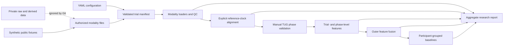

# Pipeline architecture

The pipeline keeps raw time series, quality-control evidence, trial/phase features, and modeling
artifacts separate. Explicit configuration and manifest records connect the stages.

The implementation never assumes that modality clocks begin together. The configured mapping is
`reference_time = native_time + offset_seconds`, and every applied offset is recorded with its
method, uncertainty, operator, and notes. Modeling transformations are fitted inside each
training fold, and trials are grouped by participant.

This diagram describes software flow, not clinical validity. The public demonstration contains
no video and no identifiable participant recording.
